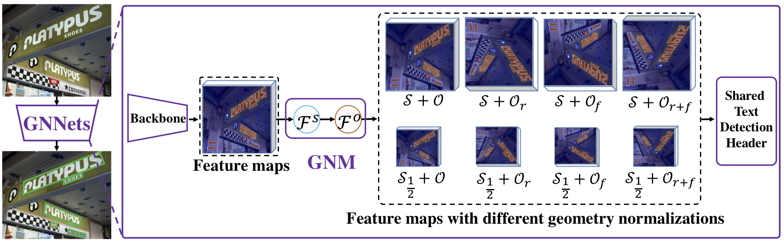

# GNNets

*Now in experimental release, suggestions welcome*.

# Paper

Youjiang Xu<sup>\*</sup>,  Jiaqi Duan<sup>\*</sup>, Zhanghui Kuang<sup>&sect;</sup>, Xiaoyu Yue, Hongbin Sun, Yue Guan, Wei Zhang. ["Geometry Normalization Networks for Accurate Scene Text Detection"](###) . [[Paper\]](###). In ICCV 2019.

```latex
@InProceedings{Xu_2019_Geometry,
author = {Xu, Youjiang and Duan, Jiaqi and Kuang, Zhanghui and Yue, Xiaoyu and Sun, Hongbin and Guan, Yue and Zhang, Wei},
title = {Geometry Normalization Networks for Accurate Scene Text Detection},
booktitle = {The IEEE International Conference on Computer Vision (ICCV)},
month = {Oct},
year = {2019}
}
```

- *Note that \* means authors contributed equally, &sect; means the corresponding author.*


# Framework




- The framework of the proposed Geometry Normalization Networks. The feature maps extracted by the backbone are fed into the Geometry Normalization Module (GNM) with  multi-branches, each of which is composed of one Scale Normalization Unit (SNU) $\mathcal{F}^s$ and Orientation Normalization Unit (ONU) $\mathcal{F}^o$. There are two different scale normalization units ($\mathcal{S}, \mathcal{S}_\frac{1}{2} $) and four orientation normalization units ($\mathcal{O}, \mathcal{O}_r, \mathcal{O}_f, \mathcal{O}_{r+f}$). With different combinations of SNU and ONU, GNM generates different geometry normalized feature maps, which are fed into one shared text detection header. 

# The Rotated ICDAR 2015

- The Rotated ICDAR 2015 Benchmark could be download form [here](###)


### Todo List

- update model performance
- add rotated ICDAR 2015 benchmark dataset


